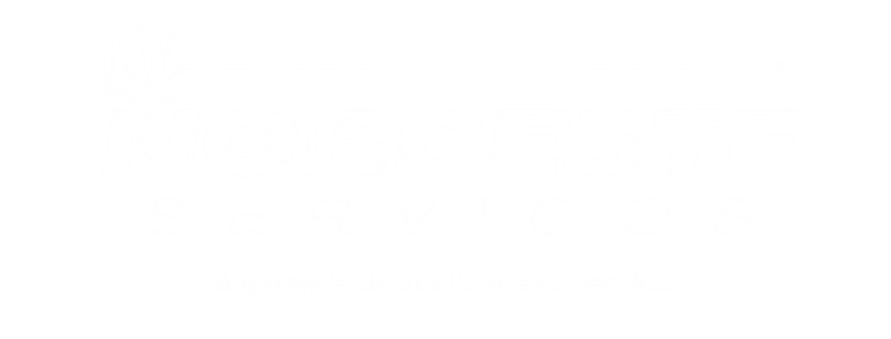
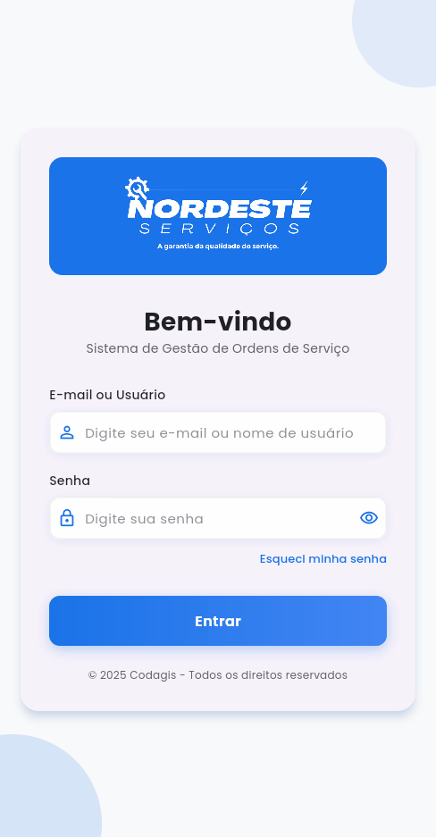
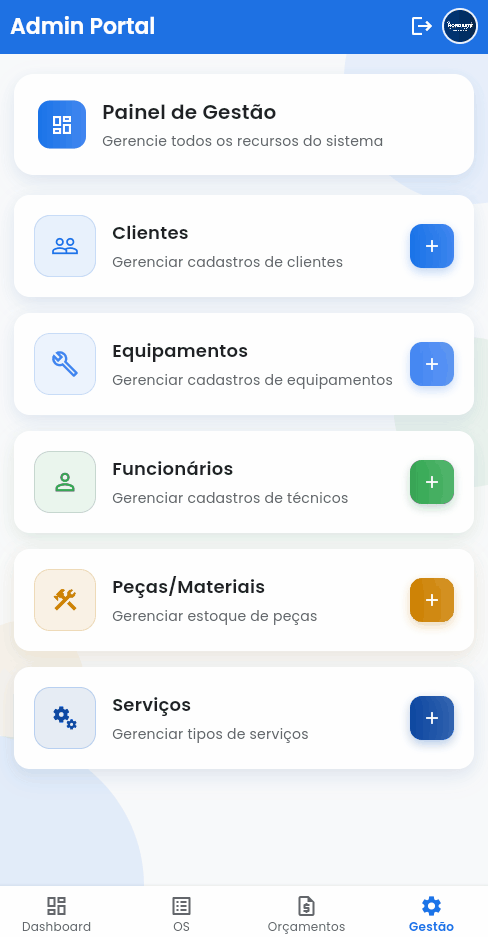
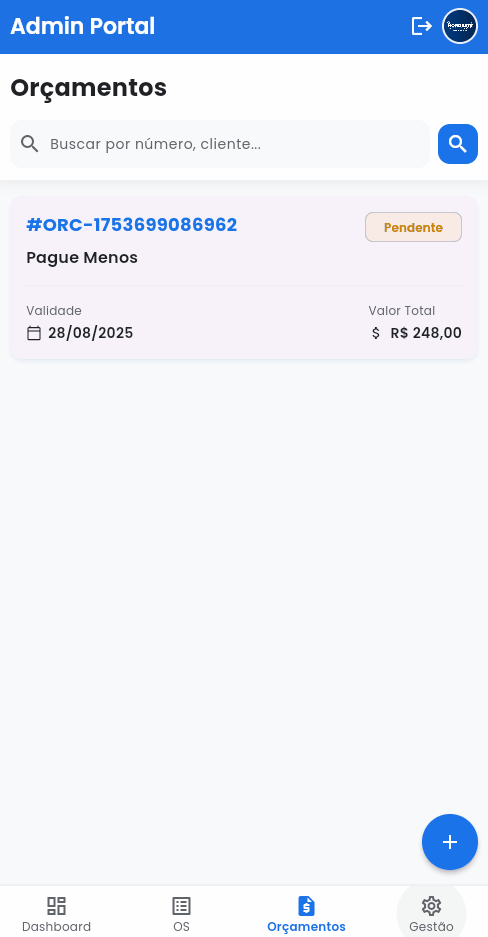
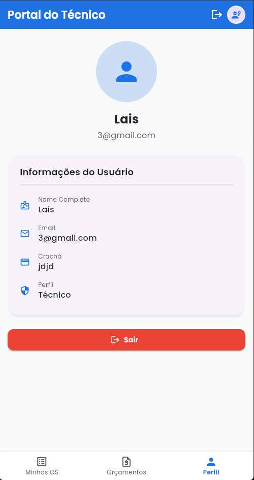
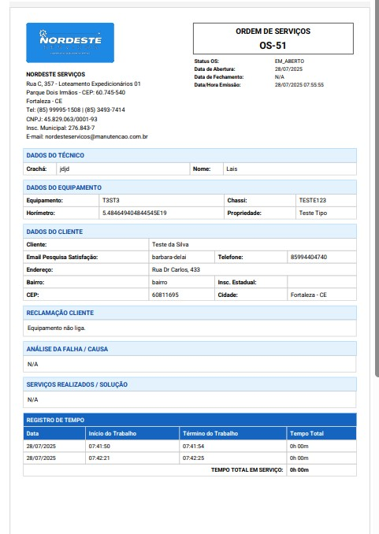
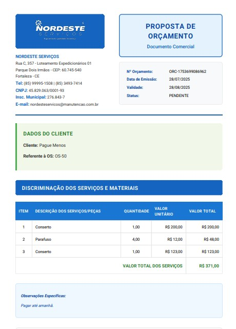

# 🚀 Nordeste Serviços - Sistema de Gestão de Ordens de Serviço

<div align="center">



**Sistema completo de gestão de ordens de serviço, orçamentos e clientes para empresas de manutenção e serviços técnicos.**

[](https://flutter.dev/)
[](https://dart.dev/)
[](LICENSE)

</div>

---

## 📱 Demonstração do App

### 🎯 Funcionalidades Principais

### Tela de Login


*Interface de login intuitiva com autenticação segura e validação de credenciais.*

### Dashboard Administrativo


*Dashboard completo para administradores com visão geral de ordens de serviço, técnicos e relatórios.*

### Gestão de Clientes


*Sistema completo de gestão de clientes com histórico de serviços e informações detalhadas.*

### Criação de Ordem de Serviço


*Interface para criação de novas ordens de serviço com seleção de cliente e equipamento.*

### Orçamentos


*Criação e gestão de orçamentos com lista de materiais e controle de valores.*

### Perfil Técnico


*Perfil do técnico com informações pessoais e configurações de trabalho.*

## 📄 Relatórios em PDF

O sistema gera relatórios profissionais em PDF para ordens de serviço e orçamentos.

### 📋 Relatório de Ordem de Serviço


**[📄 Ver PDF Completo](assets/demo/pdf-os.pdf)**

*Relatório detalhado da ordem de serviço com informações do cliente, equipamento, serviços realizados, peças utilizadas e assinatura digital.*

### 💰 Relatório de Orçamento


**[📄 Ver PDF Completo](assets/demo/pdf-orcamento.pdf)**

*Orçamento profissional com lista de materiais, valores, prazos e condições comerciais.*

### 🎯 Características dos Relatórios
- ✅ **Layout Profissional**: Design limpo e organizado
- ✅ **Informações Completas**: Todos os dados relevantes incluídos
- ✅ **Assinatura Digital**: Captura e inclusão de assinaturas
- ✅ **Fotos**: Imagens dos serviços realizados
- ✅ **Cálculos Automáticos**: Valores e totais calculados automaticamente
- ✅ **Download Direto**: Salvamento local no dispositivo

## 📱 Screenshots das Principais Telas

### Dashboard Administrativo


### Criação de Ordem de Serviço


### Orçamentos


### Relatório de OS


### Relatório de Orçamento


### Perfil Técnico


## 🎯 Sobre o Projeto

O **Nordeste Serviços** é um sistema completo de gestão desenvolvido em Flutter para empresas de manutenção e serviços técnicos. O app oferece funcionalidades robustas para administradores e técnicos, com suporte completo a operações offline e sincronização automática.

### 🎪 Principais Características

- ✅ **Interface Dupla**: Dashboard específico para administradores e técnicos
- ✅ **Sincronização Offline**: Funciona sem internet para visualização de OS
- ✅ **Assinatura Digital**: Captura de assinaturas digitais em ordens de serviço
- ✅ **Gestão Completa**: Clientes, equipamentos, peças, serviços e orçamentos
- ✅ **Relatórios PDF**: Geração profissional de relatórios com fotos e assinaturas
- ✅ **Fotos**: Captura e armazenamento de fotos das ordens de serviço
- ✅ **Multiplataforma**: Android, iOS, Web, Windows, macOS e Linux

## 🏗️ Arquitetura do Projeto

O projeto segue a arquitetura **Clean Architecture** com **Domain-Driven Design (DDD)**:

```
lib/
├── core/                    # Camada de infraestrutura
│   ├── db/                 # Banco de dados local
│   ├── network/            # Cliente HTTP
│   ├── storage/            # Armazenamento seguro
│   └── sync/               # Sincronização
├── data/                   # Camada de dados
│   ├── datasources/        # Fontes de dados
│   ├── models/             # Modelos de dados
│   └── repositories/       # Implementações dos repositórios
├── domain/                 # Camada de domínio
│   ├── entities/           # Entidades de negócio
│   ├── repositories/       # Interfaces dos repositórios
│   └── usecases/           # Casos de uso
└── presentation/           # Camada de apresentação
    ├── features/           # Funcionalidades organizadas por feature
    ├── shared/             # Componentes compartilhados
    └── styles/             # Estilos e temas
```

## 🚀 Funcionalidades

### 👨‍💼 **Dashboard Administrativo**
- Visão geral de ordens de serviço
- Gestão de técnicos e clientes
- Relatórios de desempenho
- Controle de orçamentos

### 🔧 **Dashboard Técnico**
- Lista de ordens de serviço atribuídas
- Captura de fotos e assinaturas
- Registro de tempo de trabalho
- Sincronização offline

### 👥 **Gestão de Clientes**
- Cadastro completo de clientes
- Histórico de serviços
- Informações de contato
- Endereços e equipamentos

### 📋 **Ordens de Serviço**
- Criação e edição de OS
- Captura de fotos
- Assinatura digital
- Registro de peças utilizadas
- Controle de tempo

### 💰 **Orçamentos**
- Criação de orçamentos
- Lista de materiais
- Valores e prazos
- Aprovação e controle

### 🔧 **Equipamentos e Peças**
- Cadastro de equipamentos
- Controle de estoque
- Histórico de manutenção
- Gestão de peças

### 📄 **Relatórios em PDF**
- Geração automática de relatórios
- Layout profissional e personalizado
- Inclusão de fotos e assinaturas
- Download e compartilhamento
- Histórico de relatórios gerados

## 🛠️ Tecnologias Utilizadas

### **Frontend**
- **Flutter 3.6.1** - Framework de desenvolvimento multiplataforma
- **Dart 3.6.1** - Linguagem de programação
- **Material Design** - Design system
- **Google Fonts** - Tipografia

### **Gerenciamento de Estado**
- **Riverpod** - Gerenciamento de estado reativo
- **Provider** - Injeção de dependências

### **Armazenamento e Sincronização**
- **Sembast** - Banco de dados local
- **Flutter Secure Storage** - Armazenamento seguro
- **Dio** - Cliente HTTP
- **Connectivity Plus** - Detecção de conectividade

### **Funcionalidades Especiais**
- **Signature** - Captura de assinaturas digitais
- **Image Picker** - Captura de fotos
- **File Saver** - Download de arquivos
- **Open File** - Abertura de arquivos
- **Permission Handler** - Gerenciamento de permissões

### **Desenvolvimento**
- **Freezed** - Geração de código imutável
- **JSON Serializable** - Serialização JSON
- **Build Runner** - Geração de código

## 📦 Instalação e Configuração

### **Pré-requisitos**
- Flutter SDK 3.6.1 ou superior
- Dart SDK 3.6.1 ou superior
- Android Studio / VS Code
- Git

### **Passos para Instalação**

1. **Clone o repositório**
```bash
git clone https://github.com/seu-usuario/nordeste-servicos-app.git
cd nordeste-servicos-app
```

2. **Instale as dependências**
```bash
flutter pub get
```

3. **Gere os arquivos de código**
```bash
flutter packages pub run build_runner build --delete-conflicting-outputs
```

4. **Execute o app**
```bash
flutter run
```

### **Configuração do Ambiente**

#### **Android**
```bash
flutter build apk --release
```

#### **iOS**
```bash
flutter build ios --release
```

#### **Web**
```bash
flutter build web --release
```

#### **Windows**
```bash
flutter build windows --release
```

## 🔧 Configuração da API

O app se conecta a uma API REST. Configure a URL base no arquivo:

```dart
// lib/core/network/api_client.dart
const String baseUrl = 'https://sua-api.com/api';
```

## 📱 Screenshots


### Login


### Dashboard Admin


### Dashboard Técnico


### Nova OS


### Clientes


### Orçamentos


## 🎯 Casos de Uso

### **Para Administradores**
1. **Gestão de Técnicos**: Cadastro e controle de técnicos
2. **Relatórios**: Análise de desempenho e faturamento
3. **Orçamentos**: Criação e aprovação de orçamentos
4. **Clientes**: Gestão completa da base de clientes

### **Para Técnicos**
1. **Ordens de Serviço**: Visualização e execução de OS
2. **Captura de Dados**: Fotos, assinaturas e registros
3. **Sincronização**: Trabalho offline com sincronização automática
4. **Histórico**: Acesso ao histórico de serviços


## 📊 Estrutura de Dados

### **Entidades Principais**
- **Usuario**: Administradores e técnicos
- **Cliente**: Informações dos clientes
- **Equipamento**: Equipamentos dos clientes
- **OrdemServico**: Ordens de serviço
- **Orcamento**: Orçamentos
- **PecaMaterial**: Peças e materiais
- **Servico**: Tipos de serviços

## 🧪 Testes

```bash
# Executar testes unitários
flutter test

# Executar testes de widget
flutter test test/widget_test.dart
```

## 🤝 Contribuição

1. Fork o projeto
2. Crie uma branch para sua feature (`git checkout -b feature/AmazingFeature`)
3. Commit suas mudanças (`git commit -m 'Add some AmazingFeature'`)
4. Push para a branch (`git push origin feature/AmazingFeature`)
5. Abra um Pull Request

## 📄 Licença

Este projeto está sob a licença MIT. Veja o arquivo [LICENSE](LICENSE) para mais detalhes.


---

<div align="center">

**Desenvolvido com ❤️ pela equipe Nordeste Serviços**

[](https://flutter.dev/)
[](https://dart.dev/)

</div>
